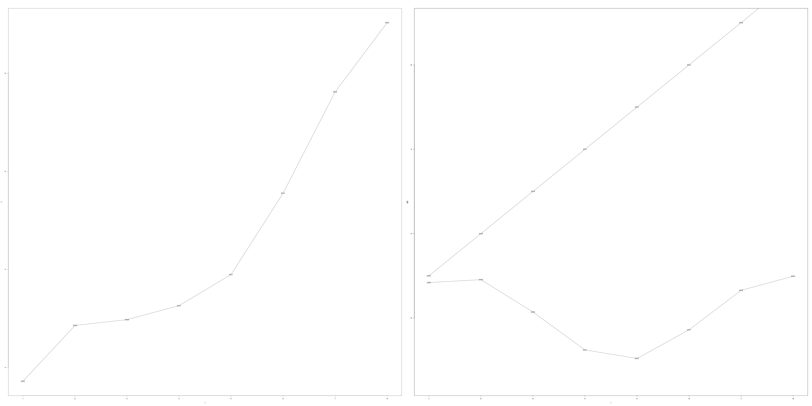
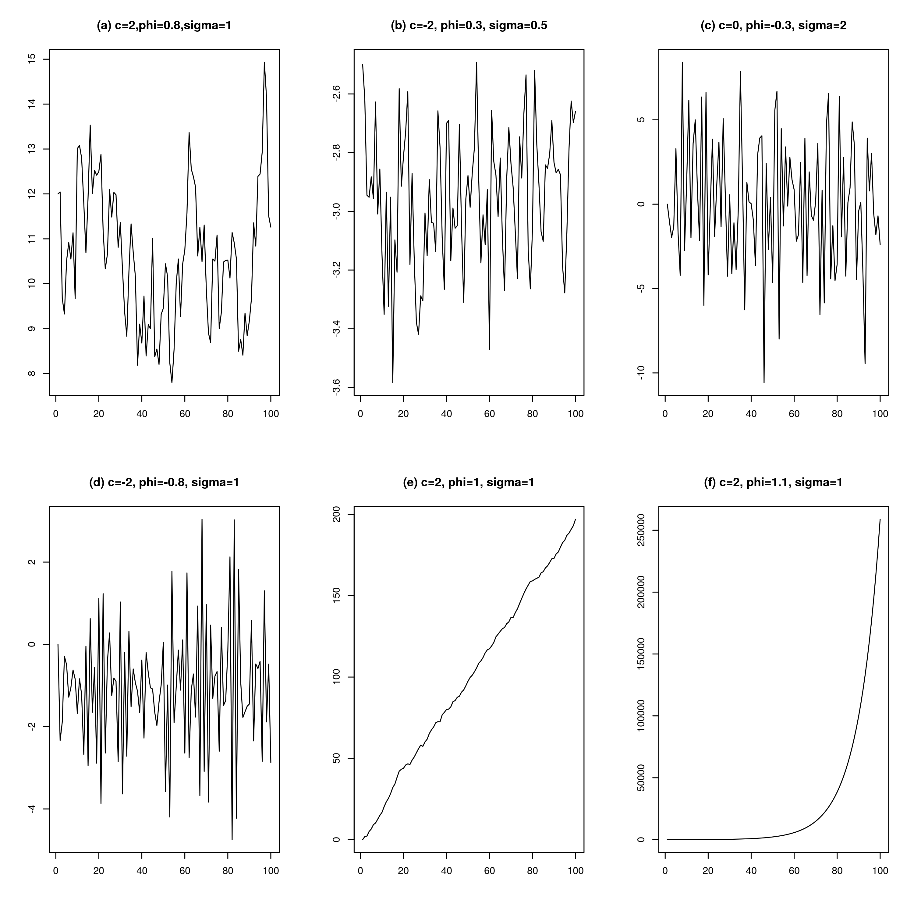
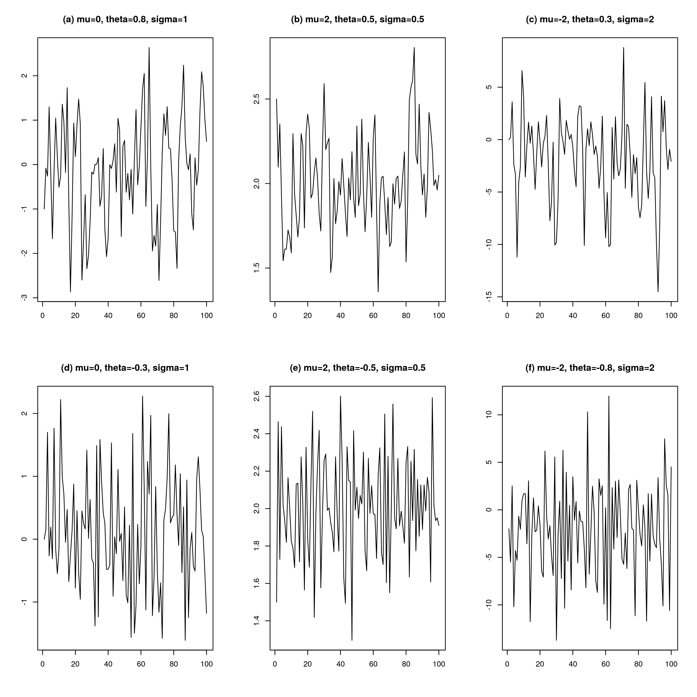
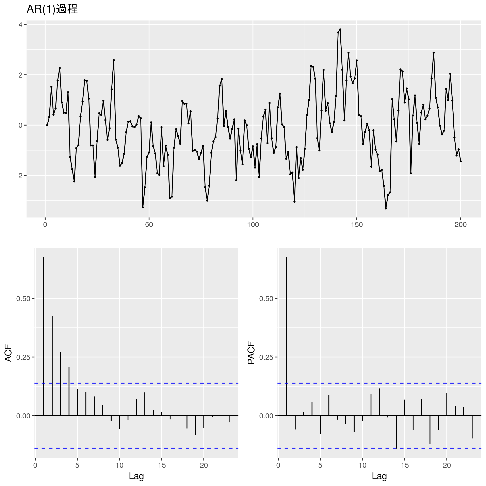
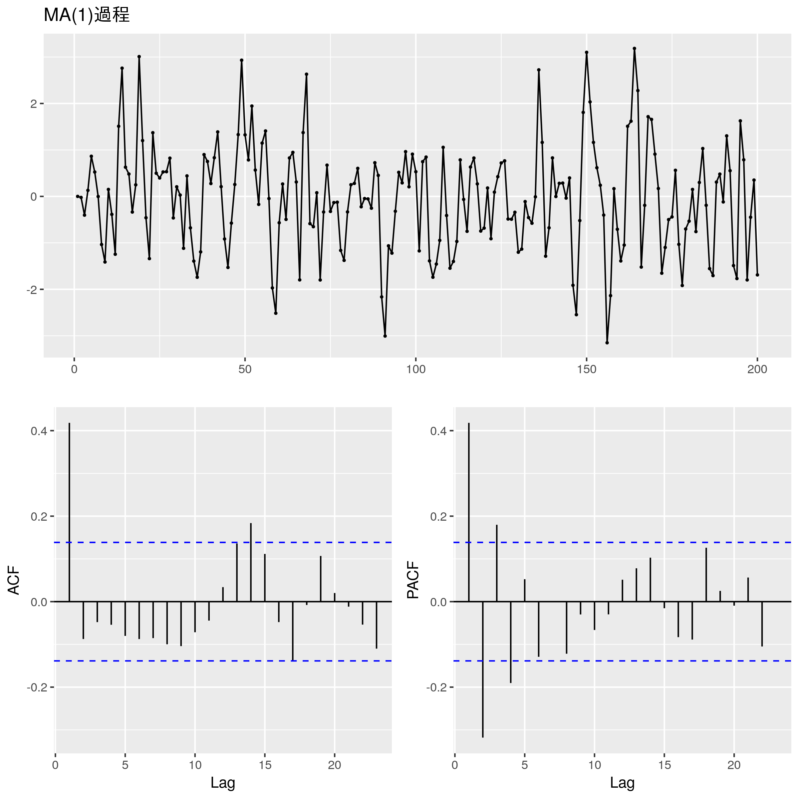
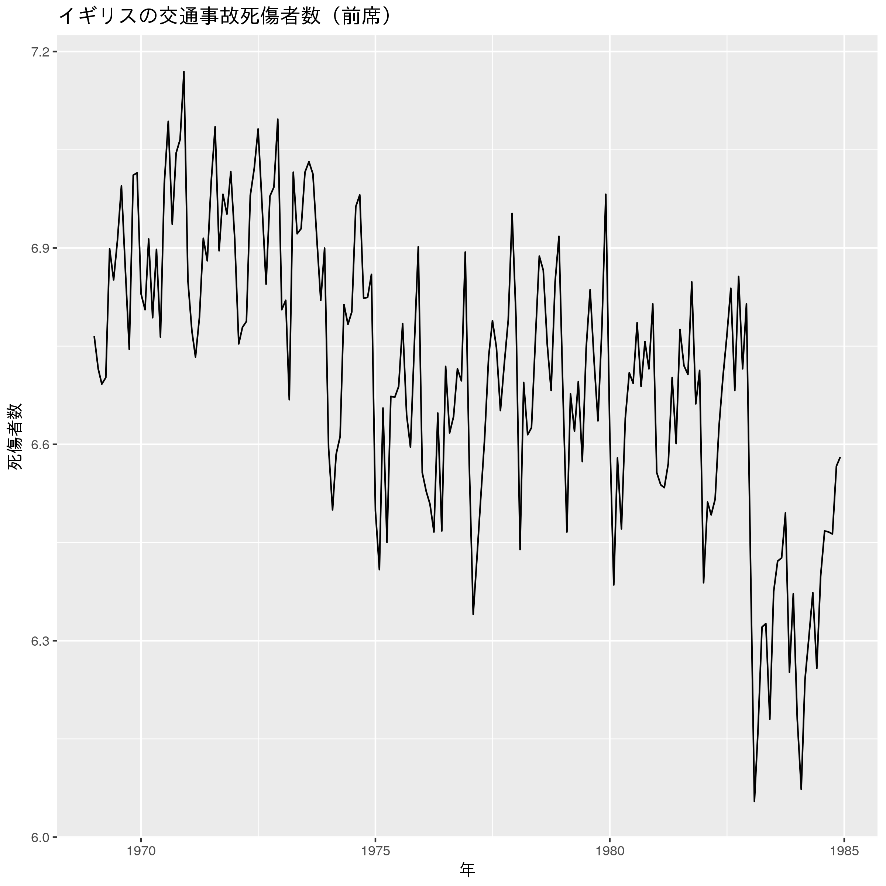
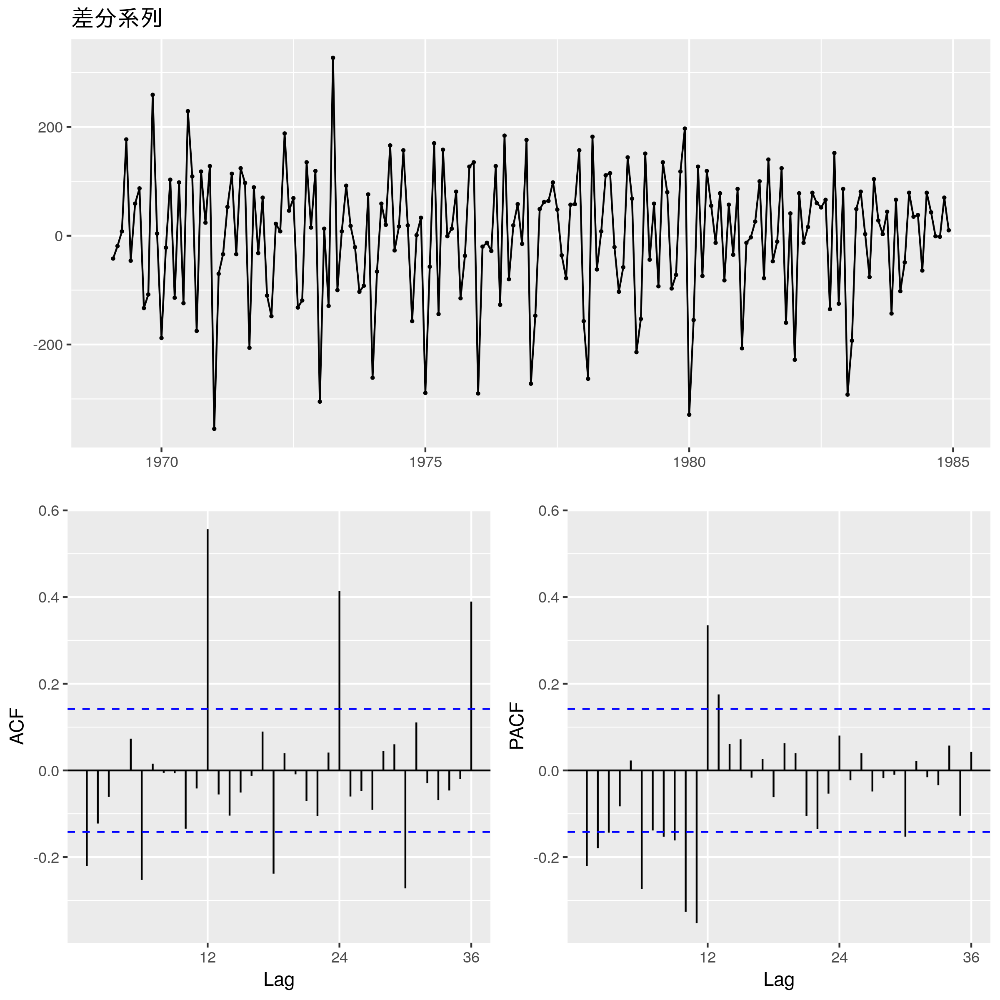
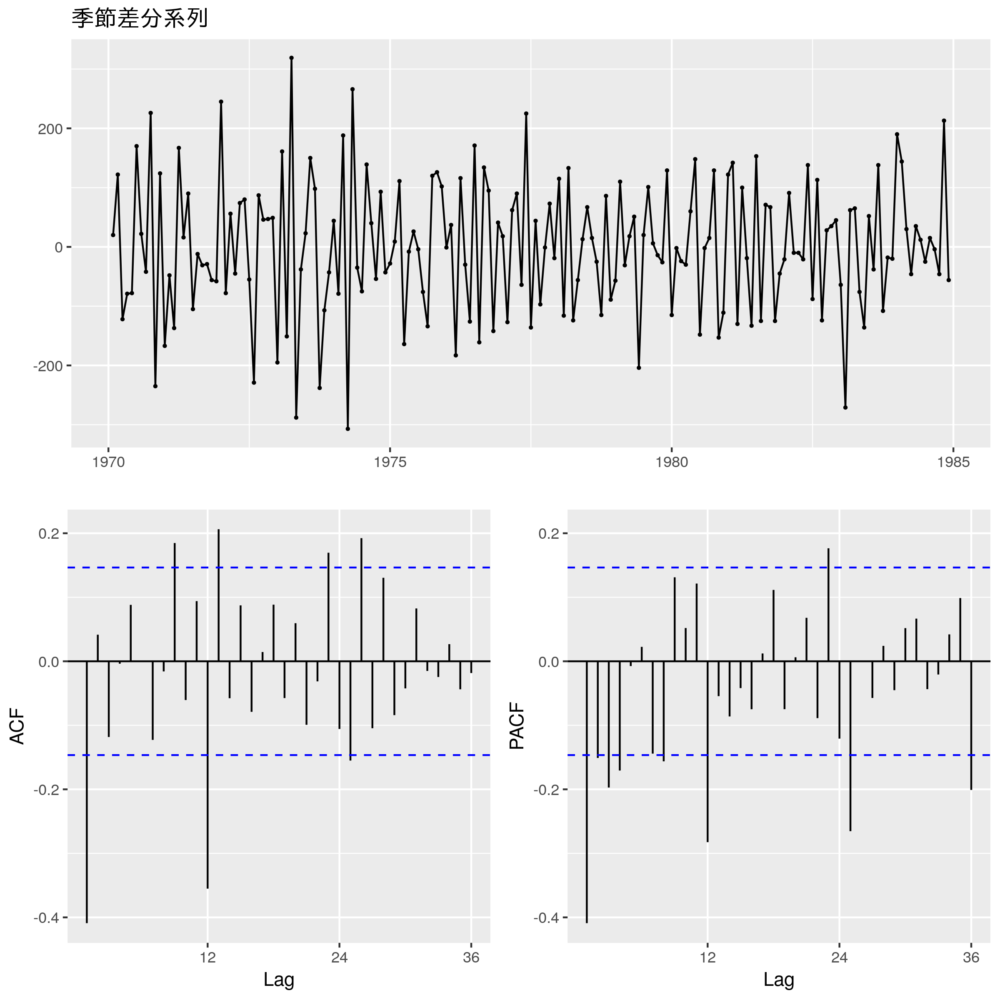
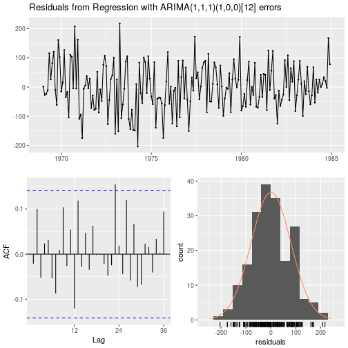

ARIMAモデルとその拡張
========================================================
author: Yuchi Matsuoka
date: May 11, 2018
autosize: true
width: 1550
height: 900

<style>
body {
    overflow: scroll;
}
</style>

ARIMAモデルの考え方
========================================================
- アイデア
  + データ生成過程(確率過程)をモデリングする．
  + 具体的には，自己相関（$y_t$と$y_{t-1}$の関係など）
  
- ちなみに
  + 曲線フィッティングの問題として解く場合もある（ex. prophet）
  + ex: 時系列データは直線(trend)とsin関数(seasonality)の和

曲線フィッティングの例
========================================================
$y(t)=g(t)+s(t)+\epsilon_t$

- $g(t)=t$：trend 
- $s(t)=sin(t)$：seasonality
- $\epsilon_t \sim N(0,1)$：noise 




自己相関のモデル化
========================================================
## AR(Auto Regressive)モデル
- 「現在の自分」が「過去の自分」に回帰される．
- AR(1)過程
$$
y_t = c+ \phi_1 y_{t-1}+\epsilon_t, \ \ \epsilon_t \sim N(0,\sigma^2)
$$
- AR(p)過程
$$
y_t = c+ \sum_{i=1}^p \phi_i y_{t-i}+\epsilon_t, \ \ \epsilon_t \sim N(0,\sigma^2)
$$

AR(1)でどんな系列が表現できるか？
========================================================


Observation
========================================================
## $y_t=c+\phi_1y_{t-1}+\epsilon_t$
- (a)(e)(f)は$\phi_1$の違いだけだが，大きく挙動が異なる．
  + 実は$|\phi_1|<1$なら定常.
  + (e)は単位根過程と呼ばれる．($c=0$なら前回出てきたランダムウォーク)
- $\phi_1$が正だとなめらかに，負だとギザギザする．
- 過去の値の影響は次第に小さくなる．
$$
y_t=0.1y_{t-1}+\epsilon_t \ = 0.1(0.1 y_{t-2}+\epsilon_{t-1})+\epsilon_t 
$$


自己相関のモデル化
========================================================
## MA(Moving Average)モデル
- 「現在の自分」と「過去の自分」で同じ値を持つ.
- MA(3)過程
$$
y_t = \mu+ \epsilon_t + \theta_1\epsilon_{t-1} + \theta_2\epsilon_{t-2} + \theta_3\epsilon_{t-3}, \ \ \epsilon_t \sim N(0,\sigma^2)
$$
 + MA(3)過程だと，
 $$
 y_{t-1} = \mu+ \epsilon_{t-1} + \theta_1\epsilon_{t-2} + \theta_2\epsilon_{t-3} + \theta_3\epsilon_{t-4}
 $$
 + つまり過去３時点と相関を持ち，それ以前とは持たない
- MA(q)過程
$$
y_t = \mu+ \sum_{j=1}^q \phi_j \epsilon_{t-j}, \ \ \epsilon_t \sim N(0,\sigma^2)
$$

MA(1)でどんな系列が表現できるか？
========================================================


Observation
========================================================
## $y_t = \mu+ \epsilon_t + \theta_1\epsilon_{t-1}$
- (a)~(f)より定数項$\mu$が時系列の平均．
- (f)→(a)の順になめらかになる．
  + $\theta$が1に近づくと，$y_t$と$y_{t-1}$が同じ成分を持つ．
- MA過程は常に定常．


データからARとMAを区別できるか？
========================================================
## ARモデルとMAモデルの特徴を思い出す．
- ARモデルは過去の影響が次第に小さくなる．
- MAモデルはその次数分だけ過去の時点の影響を受ける

データからARとMAを区別できるか？
========================================================



- ACFは次第に0に近づく．
- PACFはAR次数以下で一気に0に近づく．

データからARとMAを区別できるか？
========================================================

- ACFはMA次数以下で一気に0に近づく．
- PACFはAR(1)の自己相関がないところでも有意になっている．
  + PACFはAR過程の考え方で途中の自己相関を取り除いているため？


ARMAモデル
========================================================
## AR(p)モデルとMA(q)モデルを足し合わせる.
$$
y_t = c+ \sum_{i=1}^p \phi_i y_{t-i}+\epsilon_t+\sum_{j=1}^q \theta_j \epsilon_{t-j}, \ \ \epsilon_t \sim N(0,\sigma^2)
$$

- 定常性条件はAR(p)過程と同じ（MA(q)は常に定常）．
  + ARMA過程でモデリングするときはデータの定常性をチェックしないといけない！

ARIMAモデル
========================================================
## ARMAモデルのデータへの仮定
- $y_t$の分布は変わらない．

## ARIMAモデル(正確にはARIMA(p,1,q))のデータへの仮定
- $y_t$の「変動幅」の分布は変わらない．

d階和分過程I(d)にARMA(p,q)を適用する場合のARMAモデルをARIMA(p,d,q)と呼ぶ．


SARIMA
========================================================
## 季節成分を取り込みたい
- ここまでは連続した$y_t$の構造をモデリングしていた.
  + 例：月単位なら今月の売り上げ$y_t$と前月の売り上げ$y_{t-1}$
- 離れた$y_t$の構造もモデリングした．
  + 例：今月の売り上げ$y_t$と昨年の売り上げ$y_{t-12}$


## SARIMA$(p,d,q)(P,D,Q)[s]$
- $(p,d,q)$はARIMAのAR成分，差分，MA成分の次数．
- sの季節性（例えば1年なら$s=12$）として，その次数が$(P,D,Q)$. それぞれの意味はARIMAと一緒．
  + SARIMA$(p,d,q)(0,1,0)[12]$なら12周期で差分をとったARIMA$(p,d,q)$


定式化
========================================================

作用素$B$を以下で定義.

$$By_t=y_{t-1}$$

例えば,ARIMA$(1,0,1)$は
$y_t=\phi_1y_{t-1}+\theta_1\epsilon_{t-1}+\epsilon_{t}$なので，

$$
y_t=\phi_1By_{t}+\theta_1B\epsilon_{t}+\epsilon_{t}\\
\Leftrightarrow \ (1-\phi_1B)y_t=(1+\theta_1B)\epsilon_t.
$$

差分系列は
$$
\Delta y_t=(1-B)y_t
$$

$$
\Delta^2 y_t = (1-B)^2y_t = (1-B)(y_t-y_{t-1})\\
=(y_t-y_{t-1})-(y_{t-1}-y_{t-2})
$$

d回差分は$\Delta^dy_t$とかけることがわかる．

定式化
========================================================

結局，ARIMA(p,d,q)は$\Delta^dy_t$に対するARMA(p,q)なので，

$$
\left(1-\sum_{i=1}^p\phi_iB^i\right)\Delta^dy_t=\left(1+\sum_{j=1}^q\theta_jB^j\right)\epsilon_t
$$

であり，記号の簡単のため

$$
\phi(B)\Delta^dy_t=\theta(B)\epsilon_t
$$

と書く.

定式化
========================================================
$D$階季節差分を$\Delta_x^Dy_t$とかくと，SARIMA(0,0,0)(P,D,Q)[s]は

$$
\left(1-\sum_{I=1}^P\Phi_IB^{sI}\right)\Delta_s^Dy_t=\left(1+\sum_{J=1}^Q\Theta_JB^{SJ}\right)\epsilon_t
$$

これにARIMAを加えればいいので，SARIMA(p,d,q)(P,D,Q)[s]は

$$
\left(1-\sum_{i=1}^p\phi_iB^i\right)\left(1-\sum_{I=1}^P\Phi_IB^{sI}\right)\Delta^d\Delta_s^Dy_t=\left(1+\sum_{j=1}^q\theta_jB^j\right)\left(1+\sum_{J=1}^Q\Theta_JB^{SJ}\right)\epsilon_t
$$


外生変数付きARIMAモデル(ARIMAX)
========================================================
## ARIMAモデルに説明変数による「回帰」の要素を取り込む．

時刻$t$において，$r$個の説明変数$\{x_{1,t},...,x_{r,1}\}$が得られているとする．

- ARIMAX(p,0,q)
$$
y_t = c+ \sum_{i=1}^p \phi_i y_{t-i}+\epsilon_t+\sum_{j=1}^q \theta_j \epsilon_{t-j}+\sum_{k=1}^r\beta_kx_{k,t}.
$$

外生変数付きARIMAモデル(ARIMAX)
========================================================
## ARIMAモデルに説明変数による「回帰」の要素を取り込む．

## xの例
- 周期的でないイベント効果や異常値
  + yが売り上げのときの近隣でのイベントの有無，来場者数etc.
- 曜日や祝日などのダミー変数
  + ダミー変数化することで様々なパターンを作れる．
  + 休日，平日かで区別したいときはSARIMAだと複雑だがARIMAXだと簡単．


交通事故件数をARIMAでモデリングしてみる.
========================================================
## 使うパッケージ

```r
library(tidyverse) #dplyr,ggplot2など
library(ggfortify) #ggplot2のラッパー
library(forecast) #ARIMAなど
```


```r
head(Seatbelts) # Rに組み込みのSeatbeltsデータ
```

```
         DriversKilled drivers front rear   kms PetrolPrice VanKilled law
Jan 1969           107    1687   867  269  9059   0.1029718        12   0
Feb 1969            97    1508   825  265  7685   0.1023630         6   0
Mar 1969           102    1507   806  319  9963   0.1020625        12   0
Apr 1969            87    1385   814  407 10955   0.1008733         8   0
May 1969           119    1632   991  454 11823   0.1010197        10   0
Jun 1969           106    1511   945  427 12391   0.1005812        13   0
```
- `front`: 前席での死傷者数
- `PetroPrice`: ガソリンの値段
- `law` 前席のシートベルト装着義務法律が施行されているか


元系列
========================================================

```r
ggplot2::autoplot(log(Seatbelts[,"front"]),
                  main="イギリスの交通事故死傷者数（前席）",
                  xlab="年",
                  ylab="死傷者数")
```



明らかに定常でない．

差分系列(月)
========================================================

```r
front <- Seatbelts[,'front']
diff_front <- diff(front,lag=1)
ggtsdisplay(diff_front,main='差分系列')
```



年単位の自己相関が目立つ.

差分系列(月+年)
========================================================

```r
seas_diff_front <- diff(diff_front,lag=12)
ggtsdisplay(seas_diff_front,main='季節差分系列')
```



まだとれない（悪化した？）.

ARIMAモデル(SARIMAX)の推定
========================================================

```r
petro_law <- Seatbelts[,c("PetrolPrice","law")]
model_sarimax <- Arima(
  y = Seatbelts[,"front"],
  order = c(1,1,1),
  seasonal = list(order=c(1,0,0)),
  xreg = petro_law
)
model_sarimax
```

```
Series: Seatbelts[, "front"] 
Regression with ARIMA(1,1,1)(1,0,0)[12] errors 

Coefficients:
         ar1      ma1    sar1  PetrolPrice        law
      0.2876  -0.9417  0.6555   -2794.7275  -239.3790
s.e.  0.0824   0.0333  0.0543     868.4456    41.6115

sigma^2 estimated as 6542:  log likelihood=-1111.35
AIC=2234.7   AICc=2235.16   BIC=2254.22
```

残差に偏りがないかチェックする
========================================================

```r
checkresiduals(model_sarimax)
```



```

	Ljung-Box test

data:  Residuals from Regression with ARIMA(1,1,1)(1,0,0)[12] errors
Q* = 21.7, df = 19, p-value = 0.2995

Model df: 5.   Total lags used: 24
```
「帰無仮説: 正規分布と異なる」は棄却されなかったので一応おっけい．（少し説明できていない相関がある）


Fin.
========================================================
# 次回はモデル選択と予測...
